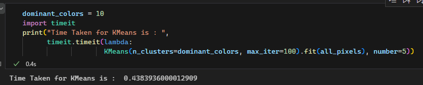

:::: titlepage
::: center
**Project 1**

**Color segmentation using K-means clustering**

Student: Nguyen Minh Nhat\
Student ID: 22127309\
Class: 22CLC05\
Applied Mathematics and Statistics\
Department of Information and Techonology\
University of Science, Viet Nam National University Ho Chi Minh City\
June 2024
:::
::::

# Introduction

The goal of this project is to segment colors in an image using K-means
clustering. By taking an image as input, the project reduces the number
of colors in the image by clustering similar colors, which is useful for
image compression and processing.

# Method

The project utilizes Python with the NumPy library for matrix
operations, Pillow for image processing, and matplotlib for
visualization. The steps involved are:

1.  Read an image in RGB format and convert the image into a 2D array of
    pixels.

2.  Convert the 2D array of pixels to a 1D array of pixels.

3.  Apply K-means clustering to the 1D array of pixels to achive pixels'
    labels and centroids corresponding to each label.

4.  Convert the 1D array of pixels back to a 2D array of pixels with the
    labels from K-means clustering.

5.  Convert the 2D array of pixels back to an image.

# Detailed Methodology

## Read an image in RGB format

*(function) read_image(img_path: str) $\rightarrow$ np.ndarray*\
Using the Pillow library, an image is read and converted to RGB format,
then to a 2D array of pixels with NumPy.

## Convert the 2D array of pixels to a 1D array of pixels

*(function) convert_img_to_1d(img_2d: np.ndarray) $\rightarrow$
np.ndarray*\
The reshape function in NumPy is used to convert the 2D array to a 1D
array.

## Apply K-means clustering

*(function) kmeans(img_1d: np.ndarray, k_clusters: int, max_iter: int,\
init_centroids: str='random') $\rightarrow$ tuple\[np.ndarray,
np.ndarray\]*\

::: adjustwidth
0.5cm To begin the K-means algorithm, centroids are required in the
first place. The centroids can be initialized in two ways throught input
parameter *'init_centroids'*:

-   'random': the random initialization method randomly selects values
    between 0 and 255 for each channel of the centroids.

-   'in_pixels': the initialization with random pixels method randomly
    selects a pixel from the original image as a centroid for each
    cluster.

-   Caution: these two methods do not guarantee the uniqueness of the
    centroids to ensure the speed of the algorithm. Which means the
    actual number of unique centroids can be less than k_clusters
    desired (some centroids are the same or have no pixel assigned to
    them). These problems are likely to happen for large k_clusters and
    small max iterations. *[\[4.2.4\]](#sec:ls)*

-   Improvements can be made by choosing pixel from image based on its
    popularity or using more advanced initialization methods like
    K-means++.

For each iteration: The process of finding the closest centroid for each
pixel is the most time-consuming part of the algorithm. This is done by
add one dimension to the pixels array
$(w * h, c) \rightarrow (w * h, 1, c)$ and subtract the centroids array
from the pixels array
$(w * h, 1, c) - (k, 1, c) \rightarrow (w * h, k, c)$. *[\[1\]](#ref:1)
[\[2\]](#ref:2)* to calculate the different between pixels and
centroids.

                        diff = (centroids - pixels[:,np.newaxis,:])

This distance is then squared and summed (with NumPy.add.reduce for
little more efficiency) along the last axis to get the minimum value for
each pixel. The naive implementation:

                        distances = np.add.reduce(diff**2, axis=2)

However, although the function is simple, it is not optimized for large
images [\[4.2.2\]](#sec:memoryOverflow). and the calculation speed is
slower than optimized libraries *[\[4.2.3\]](#sec:slowc)*. To address
that, $NumPy.einsum()$ comes in:

                        distances = np.einsum('ijk,ijk->ij', diff, diff)

The idea is to use Einstein summation convention to calculate the sum of
squared differences. The $'ijk,ijk->ij'$ string is a shorthand for the
summation of the squared differences along the last axis (the axis of
'k') of the diff array with $'ijk,ijk'$ means multiplying the diff array
with itself element-wise.\
This approach is faster and more memory-efficient(tested via Windows
Task Manager) than the naive implementation.\
FloatBarrier

{width="90%"}

The index of the minimum value is determined by using the
$NumPy.argmin()$ function along the last axis of the distances array
without the need of square rooting the distances as working with float
numbers is usually slower than integers.

                        labels = np.argmin(distances, axis=1)

However, the above implementations may overflow for large images due to
the broadcasting of the whole array. *[\[4.2.2\]](#sec:memoryOverflow)*\
The new labels are then used to calculate the new centroids by taking
the average of all the pixels in the same cluster. The process is
repeated until the maximum number of iterations is reached or the
centroids do not change significantly with the default tolerance of
$1\times10^{-5}$.

{width="90%"}
:::

## Convert the 1D array of pixels back to a 2D array of pixels

*(function) generate_2d_img(img_2d_shape: tuple, centroids: np.ndarray,
labels: np.ndarray) $\rightarrow$ np.ndarray*\
Use the labels from K-means clustering to convert the 1D array of pixels
back to a 2D array of pixels. The method used in this function may not
be optimal and can lead to more time complexity than necessary.

## Convert the 2D array of pixels back to an image 

*(function) save_img(img_2d: np.ndarray, img_path: str) $\rightarrow$
None*\
Convert the 2D array of pixels back to an image in RGB format using the
Pillow library and save the image to a file. *[\[4\]](#ref:4)*

## Show the comparison between the original image and the new image

*(function) show_img_comparison(original_img: np.ndarray, new_img:
np.ndarray) $\rightarrow$ None*\
Display the original image and the new image side by side using the
matplotlib library. *[\[4\]](#ref:4)*

## Show the image

*(function) show_img(img_2d: np.ndarray) $\rightarrow$ None*\
Display the image using the matplotlib library. *[\[5\]](#ref:5)*

## Color segmentation

*(function) color_segmentation(img_path: str, k_clusters: int = 10,
max_iter: int = 10, init_centroids: str = 'random', show_comparison:
bool = True) $\rightarrow$ np.ndarray*\
The function that combines all the above functions to segment colors in
an image using K-means clustering. The function returns the new image
after color segmentation. The function also has an option to show the
comparison between the original image and the new image by default.

## Main function

*(function) main() $\rightarrow$ None*\
The main function that demonstrates the usage of the color segmentation
function with the default parameters. The function saves the new image
to a file with a random name.

# Result

## Evaluation

![Original image *[\[3\]](#ref:3)*](Sources/colorful.jpg){width="90%"}

<figure>

  

<figcaption>k=3 (left), k=5 (middle), k=7 (right)</figcaption>
</figure>

<figure>

 

<figcaption>k=20 (left) and k=30 (right)</figcaption>
</figure>

The original result is shown in Figure 3 with the resolution of (2667,
4000) pixels with calculation max iterations = 10. Can be seen that the
results are quite distinguishable from the original image with number of
clusters $(k = 3, 5, 7, 20)$; but significantly improved with $k = 30$,
where details are reasonably close to the original one: color bars
shading still does not quite correct but somewhat shown a degree of
accuracy, borders between colors are more clear, and the image is more
vivid. Still, the results are not perfect due to the limitation of the
K-means algorithm and the implementation which will be explained in the
next section.

## Limitations of the Implementation

Due to certain limitations in the implementation, the results are not
always perfect. Some of these limitations include:\
**4.2.1** Occasionally, some of the resulting clusters are a mix of
multiple colors, regardless of the number of iterations or clusters
used.

{width="90%"}

**4.2.2** []{#sec:memoryOverflow label="sec:memoryOverflow"}The
implementation is not optimized for large images. The implementation
uses broadcasting for the whole process which can lead to memory issues
for large images. The issue can be solved by using a smaller batch of
pixels for each iteration (which is not implemented in this project).

<figure>

<figcaption>Example of memory leak in einsum implementation</figcaption>
</figure>

**4.2.3** []{#sec:slowc label="sec:slowc"} Slower speed compared to
optimized libraries like scikit-learn. *[\[6\]](#ref:6)
[\[7\]](#ref:7)*.

<figure>

 

<figcaption>Comparison between scikit-learn K-means (left) and my
K-means (right) with timeit</figcaption>
</figure>

[]{#sec:ls label="sec:ls"} **4.2.4** The implementation may not able to
produce the exact number of clusters as desired due to the
initialization method, which is likely to relate to centroids'
generation and its uniqueness. The problem is more likely to happen for
large k_clusters and small max iterations.

{width="90%"}

# References

1.  []{#ref:1 label="ref:1"} NumPy.org 2022 'Broadcasting', accessed 16
    June 2024,
    <https://numpy.org/doc/stable/user/basics.broadcasting.html>

2.  []{#ref:2 label="ref:2"} Moewie94 2020, 'K-means with numpy',
    accessed 16 June 2024,
    <https://www.kaggle.com/code/moewie94/kmeans-with-numpy>

3.  []{#ref:3 label="ref:3"} Robert Katzki 2017, 'Multicolored Wall in
    Shallow Focus Photography', accessed 16 June 2024,
    <https://unsplash.com/photos/jbtfM0XBeRc>

4.  []{#ref:4 label="ref:4"} Pillow 2022, 'Pillow documentation',
    accessed 16 June 2024, <https://pillow.readthedocs.io/en/stable/>

5.  []{#ref:5 label="ref:5"} Matplotlib 2022, 'Matplotlib
    documentation', accessed 16 June 2024,
    <https://matplotlib.org/stable/contents.html>

6.  []{#ref:6 label="ref:6"} Scikit-learn.org 2022,
    'sklearn.cluster.KMeans', accessed 16 June 2024,
    <https://scikit-learn.org/stable/modules/generated/sklearn.cluster.KMeans.html>

7.  []{#ref:7 label="ref:7"} Yuvraj Chopra 2020,
    'Project-8-Image-Segmentation-using-Sklearn-and-K-Means', accessed
    16 June 2024,
    <https://github.com/Yuvrajchopra25/Project-8-Image-Segmentation-using-Sklearn-and-K-Means>
